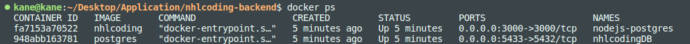
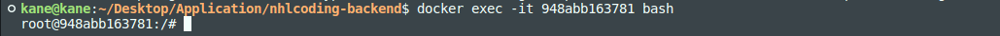
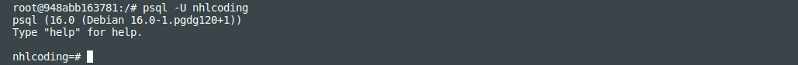
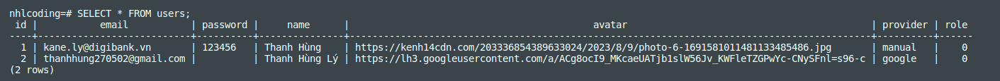

# Support Docker

## Build file

```bash
docker compose build
```

## Run file

```bash
docker compose up
```

## Create table on Docker

```bash
docker compose exec app bash
npm run migrate
```

## Access to database on Docker

### Check Docker Container

```bash
docker ps
```

<p align="center">
  
</p>

### Get containerID from IMAGE: postgres

```bash
docker exec -it <CONTAINER ID> bash
```

<p align="center">
  
</p>

### Connect to database with user nhlcoding

```bash
psql -U nhlcoding
```

<p align="center">
  
</p>

Here you can write sql statement

<p align="center">
  
</p>

### How to exit from database

```bash
\q
```

## Add virtual data

Open new terminal

```bash
docker compose exec app bash
npm run seeds
```

## Reset database

Step 1: Delete folder tmp

Step 2: Run command line:

```bash
docker compose down
docker compose up --build
```

Step 3: Open new terminal but not close current terminal. Run command line

```bash
docker compose exec app bash
npm run migrate
```

If you want have data, please run command line:

```bash
npm run seeds
```

# Test with jest

1. Create file: `<fileName>.test.js`
2. Write something in this file.
3. Open new terminal and run command line:

```bash
npm test
```
